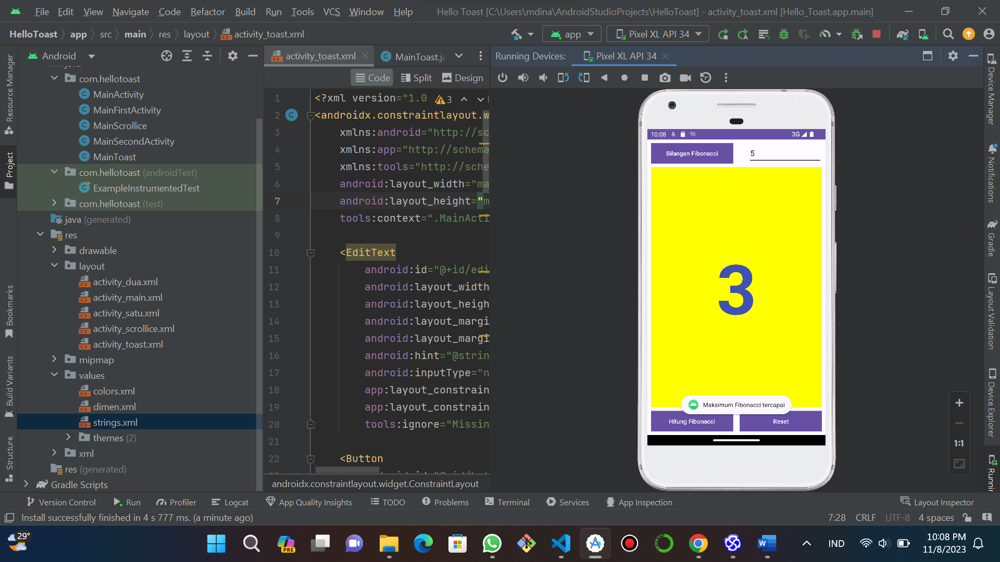

# UTS PEMROGRAMAN MOBILE
# NAMA : MUHAMMAD DIN AL AYUBI
# KELAS : TI.22.A3
# NIM : 312210293

## Input
* ```AndroidManifest.xml```
```python
<?xml version="1.0" encoding="utf-8"?>
<manifest xmlns:android="http://schemas.android.com/apk/res/android"
    xmlns:tools="http://schemas.android.com/tools">

    <application
        android:allowBackup="true"
        android:dataExtractionRules="@xml/data_extraction_rules"
        android:fullBackupContent="@xml/backup_rules"
        android:icon="@mipmap/ic_launcher"
        android:label="@string/app_name"
        android:roundIcon="@mipmap/ic_launcher_round"
        android:supportsRtl="true"
        android:theme="@style/Theme.HelloToast"
        tools:targetApi="31">
        <activity
            android:name=".MainToast"
            android:exported="true">
            <intent-filter>
                <action android:name="android.intent.action.MAIN" />

                <category android:name="android.intent.category.LAUNCHER" />
            </intent-filter>
        </activity>
    </application>
</manifest>
```
* ```MainToast.java```
```python
package com.hellotoast;

import android.os.Bundle;
import android.view.View;
import android.widget.EditText;
import android.widget.TextView;
import android.widget.Toast;

import androidx.appcompat.app.AppCompatActivity;

public class MainToast extends AppCompatActivity {
    private TextView showCount;
    private int count = 0;
    private long fibNMinus1 = 1;
    private long fibNMinus2 = 0;
    private EditText edit_max_fibonacci;

    @Override
    protected void onCreate(Bundle savedInstanceState) {
        super.onCreate(savedInstanceState);
        setContentView(R.layout.activity_toast);

        showCount = findViewById(R.id.show_count);
        edit_max_fibonacci = findViewById(R.id.edit_max_fibonacci);

        updateCountDisplay();

        fibNMinus1 = 0;
        fibNMinus2 = 1;
    }

    private void updateCountDisplay() {
        showCount.setText(String.valueOf(fibNMinus2));

        if (count % 4 == 0) {
            showCount.setTextColor(getResources().getColor(R.color.colorPrimary));
        } else if (count % 4 == 1) {
            showCount.setTextColor(getResources().getColor(R.color.colorAccent));
        } else if (count % 4 == 2) {
            showCount.setTextColor(getResources().getColor(R.color.colorPrimary));
        } else {
            showCount.setTextColor(getResources().getColor(R.color.colorAccent));
        }
    }

    public void showToast(View view) {
        Toast.makeText(this, "Bilangan Fibonacci", Toast.LENGTH_SHORT).show();
    }

    public void countUp(View view) {
        String maxFibonacciStr = edit_max_fibonacci.getText().toString();

        if (maxFibonacciStr.isEmpty()) {
            Toast.makeText(this, "Masukkan nilai maksimum Fibonacci terlebih dahulu", Toast.LENGTH_SHORT).show();
            return;
        }

        int maxFibonacci = Integer.parseInt(maxFibonacciStr);

        if (count >= maxFibonacci) {
            Toast.makeText(this, "Maksimum Fibonacci tercapai", Toast.LENGTH_SHORT).show();
            return;
        }

        long fibCurrent;
        if (count == 0 || count == 1) {
            fibCurrent = 1;
        } else {
            fibCurrent = fibNMinus1 + fibNMinus2;
        }

        fibNMinus2 = fibNMinus1;
        fibNMinus1 = fibCurrent;
        updateCountDisplay();

        count++;
    }

    public void back1(View view) {
        count = 1;
        fibNMinus1 = 1;
        fibNMinus2 = 0;
        updateCountDisplay();
    }
}
```
* ```activity_toast.xml```
```python
<?xml version="1.0" encoding="utf-8"?>
<androidx.constraintlayout.widget.ConstraintLayout
    xmlns:android="http://schemas.android.com/apk/res/android"
    xmlns:app="http://schemas.android.com/apk/res-auto"
    xmlns:tools="http://schemas.android.com/tools"
    android:layout_width="match_parent"
    android:layout_height="match_parent"
    tools:context=".MainActivity">

    <EditText
        android:id="@+id/edit_max_fibonacci"
        android:layout_width="0dp"
        android:layout_height="48dp"
        android:layout_marginEnd="8dp"
        android:layout_marginTop="8dp"
        android:hint="@string/button_label_editText_max"
        android:inputType="number"
        app:layout_constraintEnd_toEndOf="parent"
        app:layout_constraintTop_toTopOf="parent"
        tools:ignore="MissingTranslation"/>

    <Button
        android:id="@+id/button_toast"
        android:layout_width="190dp"
        android:layout_height="48dp"
        android:layout_marginStart="8dp"
        android:layout_marginTop="8dp"
        android:background="@color/colorPrimary"
        android:onClick="showToast"
        android:textColor="@android:color/white"
        android:text="@string/button_label_input"
        app:layout_constraintStart_toStartOf="parent"
        app:layout_constraintTop_toTopOf="parent" />


    <Button
        android:id="@+id/button_count"
        android:layout_width="190dp"
        android:layout_height="48dp"
        android:layout_marginStart="8dp"
        android:layout_marginEnd="8dp"
        android:layout_marginBottom="8dp"
        android:background="@color/colorPrimary"
        android:onClick="countUp"
        android:text="@string/button_label_count"
        android:textColor="@android:color/white"
        app:layout_constraintBottom_toBottomOf="parent"
        app:layout_constraintEnd_toEndOf="parent"
        app:layout_constraintHorizontal_bias="0.0"
        app:layout_constraintStart_toStartOf="parent"
        tools:ignore="UsingOnClickInXml,VisualLintButtonSize" />

    <Button
        android:id="@+id/button_finish"
        android:layout_width="190dp"
        android:layout_height="48dp"
        android:layout_marginStart="8dp"
        android:layout_marginEnd="8dp"
        android:layout_marginBottom="8dp"
        android:background="@color/colorPrimary"
        android:onClick="back1"
        android:text="@string/button_label_finish"
        android:textColor="@android:color/white"
        app:layout_constraintBottom_toBottomOf="parent"
        app:layout_constraintEnd_toEndOf="parent"
        app:layout_constraintHorizontal_bias="1.0"
        app:layout_constraintStart_toStartOf="parent"
        tools:ignore="UsingOnClickInXml" />

    <TextView
        android:id="@+id/show_count"
        android:layout_width="0dp"
        android:layout_height="0dp"
        android:layout_marginStart="8dp"
        android:layout_marginTop="8dp"
        android:layout_marginEnd="8dp"
        android:layout_marginBottom="8dp"
        android:background="#FFFF00"
        android:gravity="center_vertical"
        android:text="@string/count_initial_value"
        android:textAlignment="center"
        android:textColor="@color/colorPrimary"
        android:textSize="160sp"
        android:textStyle="bold"
        app:layout_constraintBottom_toTopOf="@id/button_count"
        app:layout_constraintEnd_toEndOf="parent"
        app:layout_constraintStart_toStartOf="parent"
        app:layout_constraintTop_toBottomOf="@id/button_toast"
        tools:ignore="RtlCompat" />

</androidx.constraintlayout.widget.ConstraintLayout>
```
* ```Color.xml```
```python
<?xml version="1.0" encoding="utf-8"?>
<resources>
    <color name="black">#FF000000</color>
    <color name="white">#FFFFFFFF</color>
    <color name="blue">#0000FF</color>
    <color name="colorPrimary">#3F51B5</color>
    <color name="colorPrimaryDark">#303F9F</color>
    <color name="colorAccent">#FF4081</color>
</resources>
```
* ```string.xml```
```python
<resources>
    <string name="app_name">Hello Toast</string>
    <string name="halo">Bagaimana Kabar Anda Hari Ini!</string>
    <string name="button_label_input">Bilangan Fibonacci</string>
    <string name="button_label_count">Hitung Fibonacci</string>
    <string name="count_initial_value">0</string>
    <string name="toast_message">Hello Toast</string>
    <string name="textview">TextView</string>
    <string name="button_label_hitung">Hitung</string>
    <string name="hitung_initial_value">0</string>
    <string name="toast_pesan">Hebat Bro!</string>
    <string name="button_main">Send</string>
    <string name="editText_main">Enter Your Message Here</string>
    <string name="text_header">Message Received</string>
    <string name="button_second">Reply</string>
    <string name="editText_second">Enter Your Reply Here</string>
    <string name="text_header_reply">Reply Received</string>
    <string name="button_label_finish">Reset</string>
    <string name="button_label_editText_max">Maximum Fibonacci</string>
    <string name="enter_fibonacci_limit">Masukan nilai maksimal</string>

</resources>
```
## Output
